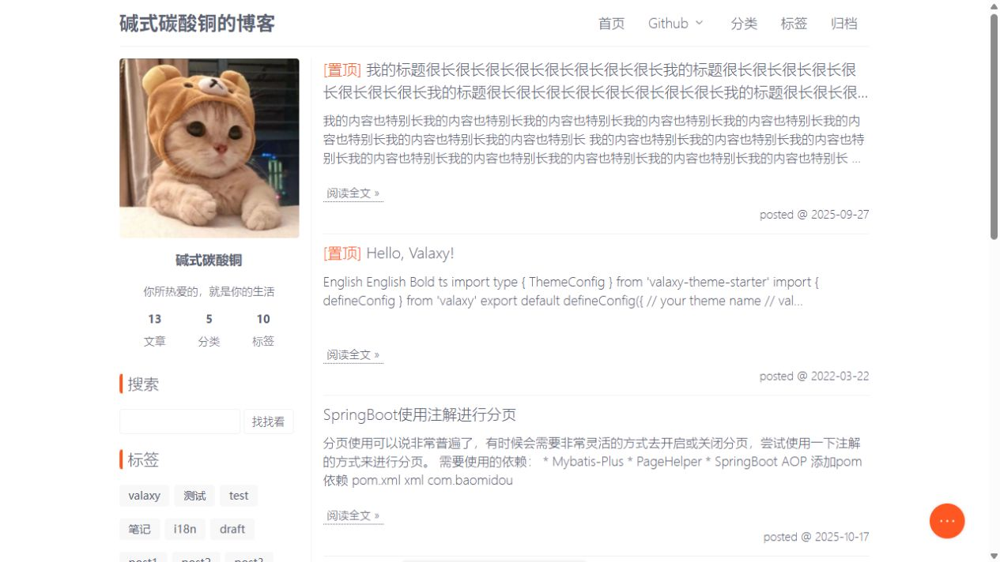

# Valaxy Theme Silence

一款专注于阅读体验的 [Valaxy](https://valaxy.site/) 博客主题，使用 Vue 3、TypeScript、UnoCSS 和 pnpm workspace 开发。

[在线预览](https://montaro2017.github.io/valaxy-theme-silence/) · [问题反馈](https://github.com/Montaro2017/valaxy-theme-silence/issues)

> [!IMPORTANT]
> 本主题是博客园主题 [esofar/cnblogs-theme-silence](https://github.com/esofar/cnblogs-theme-silence) 在 Valaxy 上的复刻与移植。页面布局、视觉风格和主要交互设计均源自原主题；本项目围绕 Valaxy、Vue 3 和静态站点场景重新实现，并非原项目的官方版本。感谢 [esofar](https://github.com/esofar) 创作并开源 Silence。

## 预览



## 特性

- 延续 cnblogs-theme-silence 简洁、克制、以内容为中心的设计
- 响应式布局，支持桌面端与移动端
- 明暗模式、主题色切换和文章目录
- 文章列表、分类、标签、归档与 Fuse 搜索
- 文章版权、赞赏、上下篇导航和自动摘要
- 使用 GitHub Discussions 的 Giscus 评论
- 支持 Valaxy SSG、RSS 和 GitHub Pages

## 安装

在 Valaxy 博客目录中安装主题：

```bash
pnpm add valaxy-theme-silence
```

在 `valaxy.config.ts` 中启用：

```ts
import { defineConfig } from 'valaxy'

export default defineConfig({
  theme: 'silence',
})
```

创建 `theme.config.ts` 配置站点外观和主题功能：

```ts
import type { ThemeConfig } from 'valaxy-theme-silence'

export default {
  // 工具栏中可切换的主题色，第一个颜色为默认值
  colors: ['#ff5722', '#0078e7', '#42b983'],

  // 是否使用圆形扩散动画切换明暗模式
  toggleDarkWithCircleTransition: true,

  header: {
    title: 'My Blog',
    navItems: [
      { title: '首页', url: '/' },
      { title: '分类', url: '/categories' },
      { title: '标签', url: '/tags' },
      { title: '归档', url: '/archives' },
      {
        title: '更多',
        children: [
          { title: 'GitHub', url: 'https://github.com/your-name', target: '_blank' },
        ],
      },
    ],
  },

  sidebar: {
    avatar: '/assets/avatar.jpg',
    author: 'Your Name',
    intro: '专注于阅读与记录',
    // 0 表示不限制显示数量
    tagLimit: 10,
    categoryLimit: 10,
    archiveLimit: 10,
  },

  footer: {
    copyright: 'Copyright © 2026 Your Name',
    beian: {
      enable: false,
      icp: '',
      url: 'https://beian.miit.gov.cn/',
    },
    powered: {
      enable: true,
      withSilence: true,
    },
  },

  post: {
    dateFormat: 'YYYY-MM-DD',
    toc: {
      serialNumber: true,
    },
  },

  giscus: {
    enable: false,
    repo: 'owner/repository',
    repoId: 'R_...',
    category: 'Comments',
    categoryId: 'DIC_...',
    mapping: 'pathname',
    strict: false,
    reactionsEnabled: true,
    emitMetadata: false,
    inputPosition: 'top',
    lang: 'zh-CN',
    loading: 'lazy',
  },
} as ThemeConfig
```

### 配置参考

| 配置项                           | 默认值                 | 说明                                     |
| -------------------------------- | ---------------------- | ---------------------------------------- |
| `colors`                         | 内置颜色列表           | 工具栏可选主题色，至少配置一个颜色       |
| `toggleDarkWithCircleTransition` | `true`                 | 启用明暗模式圆形过渡动画                 |
| `header.title`                   | 站点标题               | 顶部显示的标题                           |
| `header.navItems`                | 首页、分类、标签、归档 | 导航菜单；`children` 可创建下拉菜单      |
| `sidebar.avatar`                 | `/assets/avatar.jpg`   | 侧栏头像地址                             |
| `sidebar.author` / `intro`       | 站点作者信息           | 侧栏作者和简介                           |
| `sidebar.*Limit`                 | `0`                    | 标签、分类和归档数量限制；`0` 表示不限制 |
| `footer.beian`                   | 关闭                   | ICP 备案信息和链接                       |
| `footer.powered`                 | 开启                   | 是否显示 Valaxy 和 Silence 驱动信息      |
| `post.dateFormat`                | `YYYY-MM-DD`           | 文章列表日期格式，使用 Day.js 格式       |
| `post.toc.serialNumber`          | `true`                 | 是否为文章目录添加层级编号               |
| `giscus`                         | 关闭                   | GitHub Discussions 评论配置              |

站点信息、搜索、摘要、授权和赞赏属于 Valaxy 的 `siteConfig`，应放在 `site.config.ts`，而不是主题配置中。例如：

```ts
import { defineSiteConfig } from 'valaxy'

export default defineSiteConfig({
  title: 'My Blog',
  author: {
    name: 'Your Name',
    avatar: '/assets/avatar.jpg',
  },
  search: {
    enable: true,
    provider: 'fuse',
  },
  excerpt: {
    type: 'text',
    auto: true,
    length: 200,
  },
  comment: {
    enable: true,
  },
})
```

## 文章目录

文章 frontmatter 中的 `toc` 控制进入文章时侧边目录的默认展开状态。可以在 `site.config.ts` 中设置全站默认值：

```ts
export default defineSiteConfig({
  frontmatter: {
    toc: false,
  },
})
```

也可以在单篇文章的 frontmatter 中覆盖全站设置：

```yaml
---
title: 文章标题
toc: true
---
```

- `toc: true`：文章存在标题目录时，进入页面后自动展开侧边目录。
- `toc: false`：侧边目录默认收起，仍可通过右下角工具栏手动打开。
- `themeConfig.post.toc.serialNumber`：只控制目录是否显示层级编号，不控制展开状态。

## Giscus 评论

先在 `site.config.ts` 中启用评论，再将 [giscus.app](https://giscus.app/zh-CN) 生成的仓库配置写入 `theme.config.ts`。上面的完整示例已经列出所有 Giscus 选项，实际使用时至少需要设置：

```ts
export default {
  giscus: {
    enable: true,
    repo: 'owner/repository',
    repoId: 'R_...',
    category: 'Comments',
    categoryId: 'DIC_...',
  },
} as ThemeConfig
```

文章 frontmatter 设置 `comment: false` 可关闭单篇评论。

## 本地开发

```bash
pnpm install
pnpm dev
pnpm lint
pnpm typecheck
pnpm build
```

主题源码位于 `theme/`，演示站位于 `demo/`。构建结果生成到 `demo/dist/`。

## 致谢与许可

- 设计与交互参考：[cnblogs-theme-silence](https://github.com/esofar/cnblogs-theme-silence)，MIT © esofar
- 静态博客框架：[Valaxy](https://github.com/YunYouJun/valaxy)

本项目基于 [MIT License](./LICENSE) 发布。使用或分发时，请同时遵守所引用项目的许可要求。
